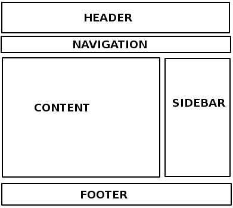

[TOC]
### 标记文本
#### 块级元素与内联元素
+ 块级元素
页面中以块的形式展示。
相对与其前面的内容它会出现在新的一行，其后的内容也会被挤到下一行展现。块级元素通常用于展示页面上结构化的内容，例如段落、列表、导航菜单、页脚、**div** 等等。

+ 内联元素
内联元素通常出现在块级元素中并包裹文档内容的一小部分，而不是一整个段落或者一组内容。内联元素不会导致文本换行：它通常出现在一堆文字之间。


*注：空元素是没有内容可结束标签的元素。*

#### 文档结构
##### 文档的主要组成部分
+ 页眉（ header 元素）
通常横跨于整个页面顶部有一个大标题 和/或 一个标志。同参存在所有页面中。

+ 导航栏（ nav 元素）
指向网站各个主要区段的超链接。通常用菜单按钮、链接或元素页表示。
类似于标题栏，导航栏通常应在所有网页之间保持一致。

+ 主内容（ main 元素）
中心的大部分区域是当前网页大多数的独有内容，例如视频、文章、地图、新闻等。在一个网站不同页面之间切换时，该部分一般是不同的。主内容中还可以有各种子内容区段，可用 article 、section  和 div  等元素表示。每个页面上只能用一次 main 元素，且直接位于  body元素 中。最好不要把它嵌套进其它元素。

+ 侧边栏（ aside 元素）
一些外围信息、链接、引用、广告等。通常与主内容相关（例如一个新闻页面上，侧边栏可能包含作者信息或相关文章链接）。

+ 页脚（ footer 元素）
横跨页面底部的狭长区域。和标题一样，页脚是放置公共信息（比如版权声明或联系方式）的，一般使用较小字体，且通常为次要内容。 还可以通过提供快速访问链接来进行 SEO。


以上内容 HTML 中的实现：




```HTML
<!DOCTYPE html><html>
  <head>
    <meta charset="utf-8">
    <title>二次元俱乐部</title>
    <link href="style.css" rel="stylesheet">
  </head>

  <body>
    <header> <!-- 本站所有网页的统一主标题 -->
      <h1>聆听电子天籁之音</h1>
    </header>
    
    <nav> <!-- 本站统一的导航栏 -->
      <ul>
        <li><a href="#">主页</a></li>
        <!-- 共n个导航栏项目，省略…… -->
      </ul>

      <form> <!-- 搜索栏是站点内导航的一个非线性的方式。 -->
        <input type="search" name="q" placeholder="要搜索的内容">
        <input type="submit" value="搜索">
      </form>
    </nav>
    
    <main> <!-- 网页主体内容 -->
      <article>
        <!-- 此处包含一个 article（一篇文章），内容略…… -->
        <section>
        <!--也可以把一篇 <article> 分成若干部分并分别置于不同的 <section> 中，也可以把一个区段 <section> 分成若干部分并分别置于不同的 <article> 中-->
        </section>
       
      </article>
      
      <aside> <!-- 侧边栏在主内容右侧 -->
        <h2>相关链接</h2>
        <ul>
          <li><a href="#">这是一个超链接</a></li>
          <!-- 侧边栏有n个超链接，略略略…… -->
        </ul>
      </aside>
    </main>
    
    <footer> <!-- 本站所有网页的统一页脚 -->
      <p>© 2050 某某保留所有权利</p>
    </footer>
  </body></html>
```

##### 无语义元素

对于一些要组织的项目或要包装的内容，现有的语义元素均不能很好对应。有时候你可能只想将一组元素作为一个单独的实体被 CSS 修饰或 Javascript 操作。为了应对这种情况，HTML提供了 div 元素 和 span 元素。应配合使用 class 属性提供一些标签。

+ span 元素是一个内联的（inline）无语义元素，最好只用于无法找到更好的语义元素来包含内容时，或者不想增加特定的含义时。
+ div 元素是一个块级无语义元素，应仅用于找不到更好的块级元素时，或者不想增加特定的意义时。

##### 换行与水平风格线

br 元素可在段落中进行换行；br 元素是唯一能够生成多个短行结构的元素。

hr 元素元素在文档中生成一条水平分割线，表示文本中主题的变化（例如话题或场景的改变）。一般就是一条水平的直线。


#### 文字排版

##### 标题和段落

+ 编辑结构层次
标题级别在每个页面不要超过三个。并且文本内容使用标题和段落进行结构化，这样有利于快速浏览以查找相关内容。标题有利于 SEO。有利于样式化和操作。
+ 语义的重要性
使用了正确的元素来给予内容正确的意思、作用以及外形。
+ 强调
在HTML中用 em 元素（emphasis）元素来标记需要强调（需要重读的内容）的文本。用斜体显示。
+ 非常重要
在HTML中用 strong 元素 (strong importance) 元素来标记重要（需要重音的内容）的文本。用粗体表示。
+ 斜体字、粗体字、下划线
i 元素, b 元素 和 u 元素出现于要在文本中使用斜体、粗体、下划线，但CSS仍然不被完全支持的时期。像这样的元素，仅仅影响表象而且没有语义，被称为表象元素（presentational elements）并且**不应该再被使用**。因为语义对可访问性，SEO（搜索引擎优化）等非常重要。

##### 基本列表

+ 无序列表
无序的列表被用来标记每个项目。每份无序的清单从 ul 元素开始，接着用 li 元素把每个列出的项目分别包裹起来。
+ 有序列表
有序的列表是根据项目的顺序列出来的。标记的结构和无序列表一样，除了你需要用 ol 元素将所有项目包裹。

##### 描述列表

描述列表的目的是标记一组项目及其相关描述。描述列表使用与其他列表类型不同的闭合标签— dl 元素; 此外，每一项都用 dt (description term) 元素闭合。每个描述都用 dd (description description) 元素闭合。

```HTML
<dl>
  <dt>内心独白</dt>
    <dd>戏剧中，某个角色对自己的内心活动或感受进行念白表演</dd>
  <dt>语言独白</dt>
    <dd>戏剧中，某个角色把自己的想法直接进行念白表演。</dd>
  <dt>旁白</dt>
    <dd>戏剧中，为渲染幽默或戏剧性效果进行的场景之外的补充注释念白</dd></dl>
```

##### 引用

+ 块引用
如果一个块级内容（一个段落、多个段落、一个列表等）从其他地方被引用，你应该把它用blockquote 元素包裹起来表示，并且在 cite 属性里用 URL 来指向引用的资源。

```HTML
<blockquote cite="https://baidu.com"><p>Hello world</p></blockquote>
```

+ 行内引用
行内元素使用 q 元素表示。

```HTML
<p><q cite="https://baidu.com">Hello world</q></p>
```


+ 引文
cite 属性的内容听起来很有用，但如果不使用 JavaScript 或 CSS，浏览器不会真的关心它，不会显示 cite 的内容。如果你想要确保引用的来源在页面上是可用的，更好的方法是把 cite 元素放到引用元素旁边。这就意味着包含引用来源的名称——即引用的书的名字。

```HTML
<p>The quote element <q cite="https://baidu.com"> intended for short quotations .</q>-- <a href="https://baidu.com"><cite>MDN q page</cite></a></p>
```


+ 缩略语
abbr 元素常被用来包裹一个缩略语或缩写，并且提供缩写的解释（包含在title属性中）

```HTML
<p>我们使用 <abbr title="超文本标记语言（Hypertext Markup Language）">HTML</abbr> 来组织网页文档。</p>
```


+ 标记联系方式
HTML使用 address 元素标记联系方式。

```HTML
<address>
  <p>Chris Mills, Manchester, The Grim North, UK</p>
 </address>
```

+ 上标和下标
 sup 元素表示上标，sub元素 表示下标。

```HTML
<p>咖啡因的化学方程式是 C<sub>8</sub>H<sub>10</sub>N<sub>4</sub>O<sub>2</sub>。</p>
<p>如果 x<sup>2</sup> 的值为 9，那么 x 的值必为 3 或 -3。</p>
```

+ 计算机代码
code 元素用于标记计算机通用代码。

+ 时间和日期
HTML 使用 time 元素将时间和日期标记为可供机器识别的格式。

```HTML
<time datetime="2016-01-20">2016年1月20日</time>
```

### 链接
#### 链接基本特性
##### 链接的解析
通过将文本转换为 a 元素内的链接来创建基本链接， 给它一个 href 属性（也称为目标），它将包含您希望链接指向的网址.

+ 链接添加 title 属性支持。
含关于链接的补充有用信息

+ 块级链接
通过将图像元素（img 元素）嵌套在链接元素(a 元素)中间，将一个连接转化为一个块元素。

##### 文档片段

超链接除了可以链接到文档外，也可以链接到HTML文档的特定部分（被称为文档片段）。要做到这一点，你必须首先给要链接到的元素分配一个id属性。

```HTML
<h2 id="Mailing_address">Mailing address</h2>
<p>Want to write us a letter? Use our <a href="contacts.html#Mailing_address">mailing address</a>.</p>
```

##### 绝对URL和相对URL

+ 绝对URL
指向由其在 Web 上的绝对位置定义的位置，包括 protocol(协议) and domain name（域名）。
+ 相对URL
指向与您链接的文件相关的位置，更像我们在前面一节中所看到的位置。

#### 链接最佳实践

+ 尽可能使用相对链接
当链接到同一网站的其他位置时，你应该使用相对链接（当链接到另一个网站时，你需要使用绝对链接）
+ 链接到非html资源 ——留下清晰的指示

```HTML
<p><a href="http://www.example.com/large-report.pdf">
  Download the sales report (PDF, 10MB)
</a></p>

<p><a href="http://www.example.com/video-stream/">
  Watch the video (stream opens in separate tab, HD quality)
</a></p>

<p><a href="http://www.example.com/car-game">
  Play the car game (requires Flash)
</a></p>
```

+ 下载时使用 download 属性
当您链接到要下载的资源而不是在浏览器中打开时，您可以使用 download 属性来提供一个默认的保存文件名。

#### 电子邮件链接

当点击一个链接或按钮时，打开一个新的电子邮件发送信息而不是连接到一个资源或页面。
使用 a 元素和 mailto：URL的方案。其最基本和最常用的使用形式为一个mailto:link （链接），链接简单说明收件人的电子邮件地址。
其中最常用的是主题(subject)、抄送(cc)和主体(body) (这不是一个真正的头字段，但允许您为新邮件指定一个短内容消息)

```HTML
<a href="mailto:nowhere@mozilla.org">Send email to nowhere</a>

<a href="mailto:nowhere@mozilla.org?cc=name2@rapidtables.com&bcc=name3@rapidtables.com&subject=The%20subject%20of%20the%20email&body=The%20body%20of%20the%20email">
  Send mail with cc, bcc, subject and body
</a>
```

#### HTML 错误排查

+ [HTML 验证](https://validator.w3.org/)

网页可以接受网址、上传一个 HTML 文档，或者直接输入一些 HTML 代码;能够判断所上传代码是否有语法错误，对于逻辑错误，这种方式无法解决。

### 多媒体与嵌入
#### HTML中的图片
通过 img 元素将图片放到网页上。smg 是个空元素，最少只需要一个 src 属性。src 属性包含了指向我们想要引入的图片的路径，可以是相对路径或绝对URL。使用绝对路径会导致浏览器去做更多的工作（例如 通过 DNS 解析域名）。

##### 网页中的图片

+ 备选文本
 img 元素的 alt 属性，可以为图片添加文字描述。
+ 高度和宽度
width：宽度
height：高度
+ 图片标题
类似于超链接，你可以给图片增加title属性来提供需要更进一步的支持信息。

##### 解说图片

可以通过图片搭配文字描述的方式解说图片。使用  HTML5 的 figure 元素和 figcaption 元素可以实现这个功能。

```HTML
<figure>
  
  <figcaption>曼彻斯特大学博物馆展出的一只霸王龙的化石</figcaption>
</figure>
```

+ figure 元素
figure 元素里不一定要是一张图片，只要是一个这样的独立内容单元。figure 元素可以是几张图片、一段代码、音视频、方程、表格或别的。
+ figcaption 元素
figcaption 元素告诉浏览器这段说明文字描述了 figure 元素的内容.

#### 视频与音频

##### video 标签

video 允许你简单的嵌入一段视频。

```HTML
<video src="rabbit320.webm" controls>
  <p>你的浏览器不支持 HTML5 视频。可点击<a href="rabbit320.mp4">此链接</a>观看</p>
 </video>
```

+ src 属性
指向你想要嵌入网页当中的视频资源，他们的使用方式完全相同。
+ controls 属性
用户必须能够控制视频和音频的回放功能。你可以使用浏览器提供的控制接口，同时你也可以使用合适的 JavaScript API构建控制接口。
+ video 标签内的段落
这个叫做后备内容 — 当浏览器不支持 video 元素标签的时候，它将会显示出来，它使我们能够对旧的浏览器做一些兼容处理。

##### 多格式支持

```HTML
<video controls>
  <source src="rabbit320.mp4" type="video/mp4">
  <source src="rabbit320.webm" type="video/webm">
  <p>你的浏览器不支持 HTML5 视频。可点击<a href="rabbit320.mp4">此链接</a>观看</p>
 </video>
```
将 src 属性从 video 元素中移除，转而将它放在几个单独的标签 source 元素当中。每个 source 元素标签页含有一个 type 属性，这个属性是可选的，但是建议你添加上这个属性 — 它包含了视频文件的 MIME types。

##### 其他 video 属性

+ width 和 height
控制视频尺寸
+ autoplay
该属性设置音频和视频内容立即播放，即使页面的其他部分还没有加载完全。建议不要设置该属性。
+ loop
该属性可以让音频或者视频文件循环播放。
+ muted
该属性会导致媒体播放时，默认关闭声音。
+ poster
该属性指向了一个图像的URL，这个图像会在视频播放前显示。通常用于粗略的预览或者广告。
+ preload
该属性被用来缓冲较大的文件，有3个值可选：
    1.none" ：不缓冲
    2."auto" ：页面加载后缓存媒体文件
    3."metadata" ：仅缓冲文件的元数据

##### audio 标签

audio 标签与 video 标签的使用方式几乎完全相同，有一个细微的差别在于的边框不同。

```HTML
<audio controls>
  <source src="viper.mp3" type="audio/mp3">
  <source src="viper.ogg" type="audio/ogg">
  <p>你的浏览器不支持 HTML5 音频，可点击<a href="viper.mp3">此链接</a>收听。</p>
 </audio>
```

#### Iframe
iframe 元素旨在允许您将其他 Web 文档嵌入到当前文档中。这很适合将第三方内容纳入您的网站

##### 基本属性

+ allowfullscreen 属性
如果可以设置，可以通过全屏 API 设置为全屏模式。
+ frameborder 属性
如果设置为1，则会告诉浏览器在此框架和其他框架之间绘制边框，这是默认行为。0删除边框。不推荐设置，可以通过在 CSS 中使用 border:none 来设置。
+ src 属性
包含指向要嵌入文档的 URL 路径
+ width 和 height 元素
设置 iframe 的宽度和高度
+ 备选内容
与 video 元素等其他类似元素相同，您可以在 iframe 元素之间包含备选内容，如果浏览器不支持 iframe，将会显示备选内容。
+ sandbox 属性
该属性可以提高安全性设置;

##### 安全隐患

+ 只在必要时嵌入
只在完全需要时嵌入第三方内容，您可以省去很多麻烦。
+ 使用 HTTPS
绝对不能使用HTTP嵌入第三方内容
＋　始终使用　sandbox　属性
想尽可能减少攻击者在你的网站上做坏事的机会，那么你应该给嵌入的内容仅能完成自己工作的权限。
+ 配置 CSP 指令
CSP 代表内容安全策略，它提供一组HTTP标头（由web服务器发送时与元数据一起发送的元数据），旨在提高HTML文档的安全性。在 iframe 安全性方面，您可以将服务器配置为发送适当的 [X-Frame-Options](https://blog.mozilla.org/security/2013/12/12/on-the-x-frame-options-security-header/)  标题。这样做可以防止其他网站在其网页中嵌入您的内容（这将导致点击和一系列其他攻击）

*沙盒一个允许包含在其里的代码以适当的方式执行或者用于测试，但不能对其他代码库（意外或恶意）造成任何损害的容器称为沙盒*

#### embed 和 object 元素
embed 和 object 元素的功能不同于 iframe ， 这些元素是用来嵌入多种类型的外部内容的通用嵌入工具，其中包括像 Java 小程序和 Flash，PDF等。

|  | embed | object |
| --- | --- | --- |
| 嵌入内容的网址 | src | data |
| 嵌入内容的准确媒体类型 | type | type |
| 由插件控制的框的高度和宽度（以CSS像素为单位） | height/width | height/width |
| 名称和值，将插件作为参数提供  | 具有这些名称和值的ad和hoc属性  |  单标签 param 元素，包含在内 object  |
| 独立的HTML内容作为不可用资源的回退 |	不支持 |包含在 object 元素之后的 param 元素 |


### 表格
#### 表格基础

```HTML
<table>
  <tr>
    <td>&nbsp;</td>
    <td>Knocky</td>
  </tr>
  <tr>
    <td>Breed</td>
    <td>Jack Russell</td>
  </tr>
  <tr>
    <td>Age</td>
    <td>16</td>
  </tr>
  <tr>
    <td>Owner</td>
    <td>Mother-in-law</td>
  </tr>
  <tr>
    <td>Eating Habits</td>
    <td>Eats everyone's leftovers</td>
  </tr>
</table>
```

##### 表格标题

可以通过 th 元素为表格添加标题.可以明显突出标题，这样可以更加简单地找到你想找的数据.表格标题也有额外的好处，随着 scope 属性，这个属性允许你让表格变得更加无障碍，每个标题与相同行或列中的所有数据相关联。

##### 单元格跨越多行多列

表格中的标题和单元格有 colspan 和 rowspan 属性,这两个属性可以实现允许单元格跨越多行多列.如:colspan="2" 使一个单元格的宽度是两个单元格

##### 为表格中的列提供相同的样式
col 和 colgroup 元素可以定义整列数据的样式信息.

```HTML
  <colgroup>
    <col>
    <col style="background-color: yellow">
  </colgroup>
  <tr>
    <th>Data 1</th>
    <th>Data 2</th>
  </tr>
  <tr>
    <td>Calcutta</td>
    <td>Orange</td>
  </tr>
  <tr>
    <td>Robots</td>
    <td>Jazz</td>
  </tr>
</table>
```
上面使用了两个 col 来定义“列的样式”，每一个 col 都会制定每列的样式,对于第一列，我们没有采取任何样式，但是我们仍然需要添加一个空的 col 元素，如果不这样做，那么我们的样式就会应用到第一列上，这和我们预想的不一样。

```HTML
<colgroup>
  <col style="background-color: yellow" span="2">
</colgroup>
```
通过包含包含 span 属性把这种样式信息应用到每一列.

#### 表格高级特性
##### 表格标题
使用 caption 元素为表格添加标题.标题意味着包含对于表格内容的描述.
##### 表格结构
```HTML
<thead>
  <tr>
    <th id="purchase">Purchase</th>
    <th id="location">Location</th>
    <th id="date">Date</th>
  </tr>
</thead>
<tbody>
<tr>
  <th id="haircut">Haircut</th>
  <td headers="location haircut">Hairdresser</td>
  <td headers="date haircut">12/09</td>
</tr>

  ...

</tbody>
<tfoot>

...

</tfoot>
```
通过使用 thead ,  tfoot ,和  tbody元素可以使表格更加结构化,这些元素允许你把表格中的部分标记为表头、页脚、正文部分。

##### scope 属性

scope 属性，可以添加在 th 元素中，用来帮助屏幕阅读设备更好地理解那些标题单元格，这个标题单元格到底是列标题呢，还是行标题。

```HTML
<thead>
  <tr>
    <th scope="col">Purchase</th>
    <th scope="col">Location</th>
    <th scope="col">Date</th>
    <th scope="col">Evaluation</th>
    <th scope="col">Cost (€)</th>
  </tr>
  <tr>
  <th scope="row">Haircut</th>
  <td>Hairdresser</td>
  <td>12/09</td>
  <td>Great idea</td>
  <td>30</td>
</tr>
</thead>
```
scope 还有两个可选的值 ： colgroup 和 rowgroup。这些用于位于多个列或行的顶部的标题.


### 表单

#### 表单基础
##### 设计表单
要记住：表单越大，失去用户的风险就越大。保持简单，保持专注:只要求必要的数据.

##### form 元素
所有的表单都以一个 form 元素开始.这个元素正式定义了一个表单。就像 div 元素或 p 元素，它是一个容器元素，但它也支持一些特定的属性来配置表单的行为方式。它的所有属性都是可选的，但实践中最好至少要设置action属性和method属性。

+ action 属性定义了在提交表单时,应该把所收集的数据送给谁(/那个模块)(URL)去处理。
+ method 属性定义了发送数据的HTTP方法(它可以是“get”或“post”)

##### lable ,input 和 textarea 元素

```HTML
<form action="/my-handling-form-page" method="post">
  <div>
    <label for="name">Name:</label>
    <input type="text" id="name">
  </div>
  <div>
    <label for="mail">E-mail:</label>
    <input type="email" id="mail">
  </div>
  <div>
    <label for="msg">Message:</label>
    <textarea id="msg"></textarea>
  </div>
</form>
```
使用 div 元素可以使我们更加方便地构造我们自己的代码，并且更容易样式化.所有 label 元素上使用 for 属性；它是将标签链接到表单小部件的一种正规方式。这个属性引用对应的小部件的id。在 input 元素中，最重要的属性是 type 属性。这个属性非常重要，因为它定义了 input 属性的行为方式。它可以从根本上改变元素.

##### button 元素
您会看到 button 元素也接受一个 type属性，它接受submit, reset或者 button 三个值中的任一个。button 元素的主要**优点**是， input 元素只允许纯文本作为其标签，而 button 元素允许完整的HTML内容，允许更复杂、更有创意的按钮文本。

#####  fieldset 和 legend 元素
fieldset 元素是一种方便的用于创建具有相同目的的小部件组的方式，出于样式和语义目的。 你可以在 fieldset 开口标签后加上一个 legend 元素来给 fieldset  标上标签。 legend 的文本内容正式地描述了 fieldset 里所含有部件的用途。

```HTML
<form>
  <fieldset>
    <legend>Fruit juice size</legend>
    <p>
      <input type="radio" name="size" id="size_1" value="small">
      <label for="size_1">Small</label>
    </p>
    <p>
      <input type="radio" name="size" id="size_2" value="medium">
      <label for="size_2">Medium</label>
    </p>
    <p>
      <input type="radio" name="size" id="size_3" value="large">
      <label for="size_3">Large</label>
    </p>
  </fieldset>
</form>
```
##### 用于表单的通用HTML结构

用 div 元素包装标签和它的小部件是很常见的做法。p 元素也经常被使用，HTML列表也是如此（后者在构造多个复选框或单选按钮时最为常见）。
除了 fieldset 元素之外，使用HTML标题（例如，h1、h2）和分段（如 section）来构造一个复杂的表单也是一种常见的做法。

##### 原生表单部件

+ 通用属性

| 属性名称 | 默认值 | 描述 |
| --- | --- | --- |
| autofocus | (false) | 指定当页面加载时元素应该自动具有输入焦点，除非用户覆盖它 |
| disabled | (false) | 示用户不能与元素交互。如果没有指定这个属性，元素将从包含它的元素中继承设置 |
| form |  | 小部件与之相关联的表单元素。属性值必需是同个文档中的 form 元素的 id属性。 |
| name |  | 元素的名称;这是跟表单数据一起提交的。 |
| value |  | 元素的初始值。 |

+ 文本输入框

	- 单行文本框 `<input type="text" id="comment" name="comment" value="I'm a text field">`
	- 单行文本框 `
	- Email 地址框 `<input type="email" id="email" name="email" multiple>`
	- 密码框 `<input type="password" id="pwd" name="pwd">`
	- 搜索框 `<input type="search" id="search" name="search">`
	- 电话号码栏 `<input type="tel" id="tel" name="tel">`
	- URL 栏 `<input type="url" id="url" name="url">`
	- 多行文本框 `<textarea cols="30" rows="10"></textarea>`
+ 下拉内容

	- 选择框 
	`<select id="simple" name="simple">`
	`<option>Banana</option>`
	`<option>Cherry</option>`
	`<option>Lemon</option>`
	`</select>`
	- 多选选择框
	`<select multiple id="multi" name="multi">`
	`<option>Banana</option>`
	`<option>Cherry</option>`
	`<option>Lemon</option>`
	`</select>`
	- 自动补全选择框
	`<label for="myFruit">What's your favorite fruit?</label>`
	`<input type="text" name="myFruit" id="myFruit" list="mySuggestion">`
	`<datalist id="mySuggestion">`
	`<option>Apple</option>`
	`<option>Banana</option>`
	`</datalist>`
+ 可选中项

	- 单选按钮 `<input type="radio" checked id="soup" name="meal">`
	- 复选框 `<input type="checkbox" checked id="carrots" name="carrots" value="carrots">`

+ 按钮

	- submit `<input type="submit" value="This is a submit button">`
	- reset `<input type="reset" value="This is a reset button">`
	- button `<input type="button" value="This is an anonymous button">`

+ 高级表单元素

	- 数字 `<input type="number" name="age" id="age" min="1" max="10" step="2">`
	- 滑块 `<input type="range" name="beans" id="beans" min="0" max="500" step="10">`
	- 日期选择器 
	`<input type="datetime-local" name="datetime" id="datetime">`,
	`<input type="month" name="month" id="month">`,
	`<input type="time" name="time" id="time">`,
	`<input type="week" name="week" id="week">`
	- 拾色器 `<input type="color" name="color" id="color">`
+ 其他部件

	- 文件选择器 `<input type="file" name="file" id="file" accept="image/*" multiple>`
	- 隐藏内容 `<input type="hidden" id="timestamp" name="timestamp" value="1286705410">`
	- 图像按钮 `<input type="image" alt="Click me!" src="my-img.png" width="80" height="30" />`
	- 进度条 `<progress max="100" value="75">75/100</progress>`
	- 仪表 `<meter min="0" max="100" value="75" low="33" high="66" optimum="50">75</meter>`

##### 表单提交

##### action
在没有 action 属性的情况下，form 数据被发送到表单出现的相同页面上

##### 表单发送文件
用HTML表单发送文件是一个特殊的例子。文件是二进制数据——或者被认为是这样的——而所有其他数据都是文本数据。由于HTTP是一种文本协议，所以处理二进制数据有特殊的要求。

**enctype** 属性允许您指定在提交表单时所生成的请求中的 Content-Type 的 HTTP 数据头的值。这个数据头非常重要，因为它告诉服务器正在发送什么样的数据。默认情况下，它的值是application/x-www-form-urlencoded。它的意思是：“这是已编码为URL参数的表单数据。”

如果你想要发送文件，你需要额外的三个步骤：

+ 将 method 属性设置为POST，因为文件内容不能放入URL参数中。
+ 将 enctype 的值设置为 multipart/form-data，因为数据将被分成多个部分，每个文件单独占用一个部分，表单正文中包含的文本数据（如果文本也输入到表单中）占用一个部分。
+ 包含一个或多个 File picker 小部件，允许用户选择将要上传的文件。

##### 常见安全问题

+ XSS 和 CSRF
跨站脚本(XSS)和跨站点请求伪造(CSRF)是常见的攻击类型，它们发生在当您将用户发送的数据显示给这个用户或另一个用户时。
CSRF 攻击类似于XSS攻击，因为它们以相同的方式开始攻击——向Web页面中注入客户端脚本——但它们的目标是不同的。CSRF 攻击者试图将权限升级到特权用户(比如站点管理员)的级别，以执行他们不应该执行的操作(例如，将数据发送给一个不受信任的用户)。XSS 攻击利用用户对 web 站点的信任，而CSRF攻击则利用网站对其用户的信任。

解决方案:为了防止这些攻击，您应该始终检查用户发送给服务器的数据(如果需要显示)，尽量不要显示用户提供的HTML内容。相反，您应该对用户提供的数据进行处理，这样您就不会逐字地显示它。

+ SQL注入
SQL 注入是一种试图在目标web站点使用的数据库上执行操作的攻击类型。这通常包括发送一个SQL请求，希望服务器能够执行它（通常发生在应用服务器试图存储由用户发送的数据时）

+ HTTP数据头注入和电子邮件注入
这种类型的攻击出现在当您的应用程序基于表单上用户的数据输入构建HTTP头部或电子邮件时。这些不会直接损害您的服务器或影响您的用户，但它们会引发一个更深入的问题，例如会话劫持或网络钓鱼攻击。

*注:永远不要相信你的用户*

#### 表单验证

表单验证是指当你向 Web 应用输入数据时，应用会验证你输入的数据是否是正确的。并且一般都会明确的告诉你错误发生在哪里。

表单验证的优点:
+ 我们希望以正确的格式获取到正确的数据 .防止用户输入无效的数据,影响软件的正常运行.
+ 我们希望保护我们的用户,强制用户输入安全的密码，有利于保护他们的账户信息。
+ 我们希望保护我们自己 ,恶意用户有很多通过滥用应用中缺乏保护的表单破坏应用的方法.

##### 不同类型的表单验证
+ 客户端校验:
发生在浏览器端，表单数据被提交到服务器之前，这种方式相较于服务器端校验来说，用户体验更好，它能实时的反馈用户的输入校验结果.

	- Javascript 验证
	- HTML5 内置验证(required 属性)	
+ 服务端验证
生在浏览器提交数据并被服务器端程序接收之后 —— 通常服务器端校验都是发生在将数据写入数据库之前，如果数据没通过校验，则会直接从服务器端返回错误消息，并且告诉浏览器端发生错误的具体位置和原因，服务器端校验不像客户端校验那样有好的用户体验，因为它直到整个表单都提交后才能返回错误信息。但是服务器端校验是你的应用对抗错误/恶意数据的最后防线.

##### 内置表单验证方式
+ input 元素约束校验
+ require 属性
+ 正则表达式校验
+ 限制输入的长度


##### JavaScript 校验方式
+ 约束校验的 API
+ 不使用内置 API 时的表单验证

